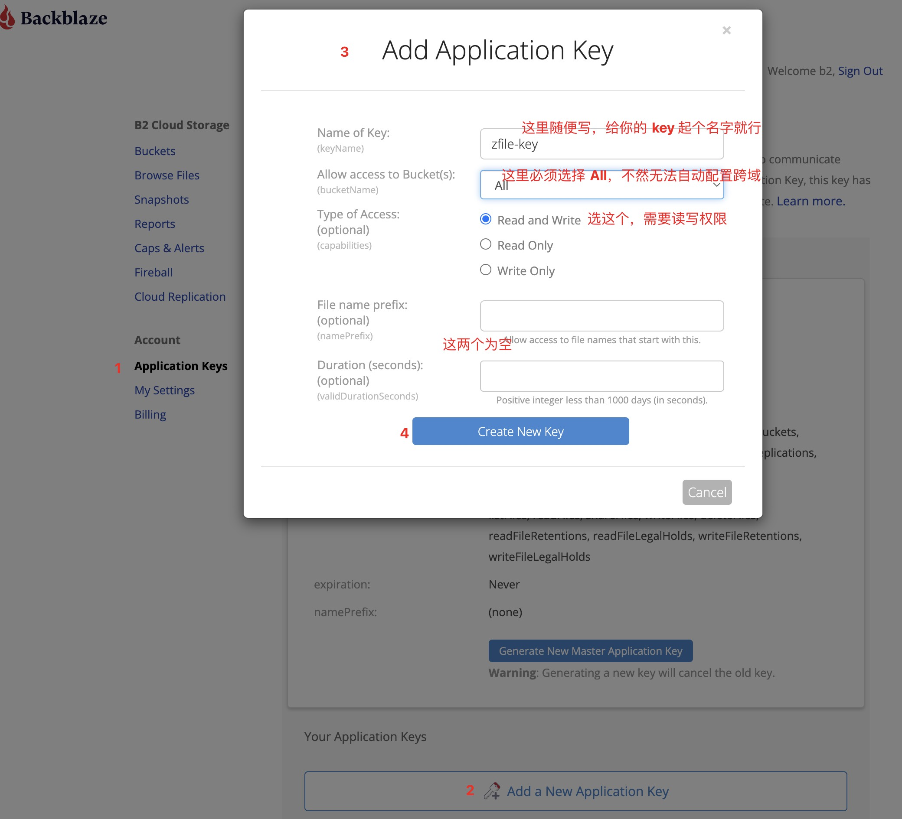
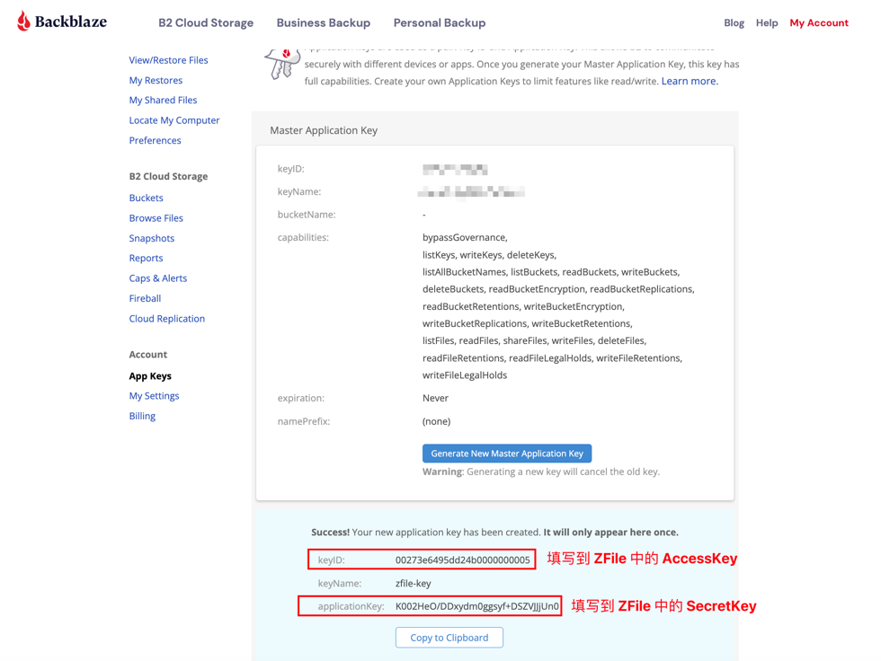
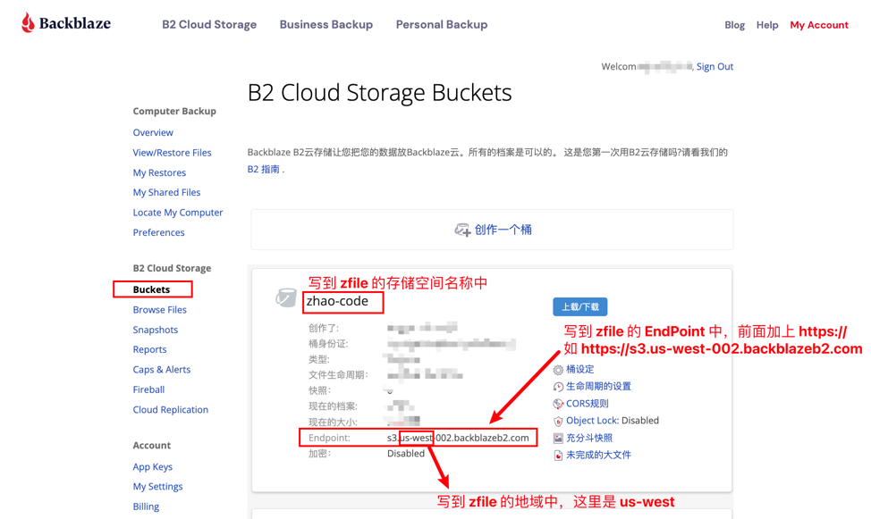

# Backblaze

ZFile 中选择 S3 通用协议，按照下图指示填写即可。

剩余的参数：
- Bucket 域名 / CDN 加速域名： 可以为空，如果不为空，就使用你指定的域名下载（请自行确保自己指定的域名是否可用），否则使用默认的域名下载。
- 基路径：写 / 即可。
- 是否是私有空间：勾选上是
- 域名风格：两种都支持
- 下载签名有效期：根据你需要设置
- 是否自动配置 CORS 跨域设置：勾选上是，如果勾选上报错，则勾选否再保存。
