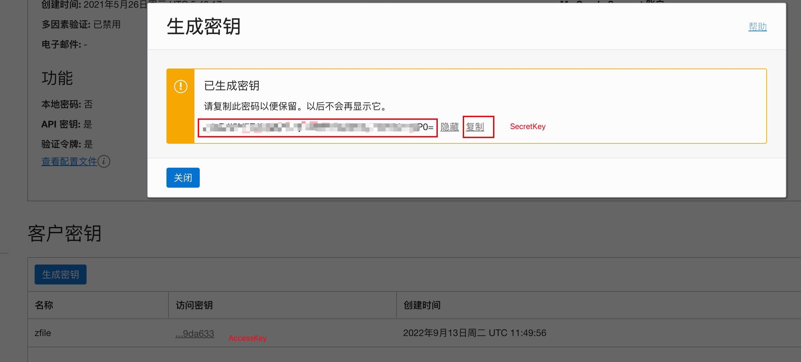
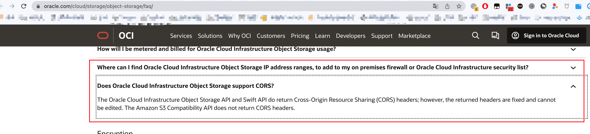

# Oracle 对象存储

## AccessKey & SecretKey

## EndPoint & 地域 & 存储源名称

https://docs.oracle.com/en-us/iaas/api/#/en/s3objectstorage/20160918/

## 其他选项

- 加速域名：可以不写，如果写了，那么就是使用加速域名访问，否则使用默认域名访问
- 是否是私有空间：这个无所谓，因为 Oracle 对象存储强制都是私有空间，所以这个选项无效。
- 域名风格：Oracle 对象存储只支持路径风格，所以这里选择路径风格
- 是否自动配置 CORS 跨域设置：选择否，因为 Oracle 对象存储不支持这个 API，且无法通过其他方式设置，**也就是说目前 Oracle 对象存储无法使用 API 对接上传功能**，信息来源自 2022-09-13，参考：https://www.oracle.com/cloud/storage/object-storage/faq/
  
