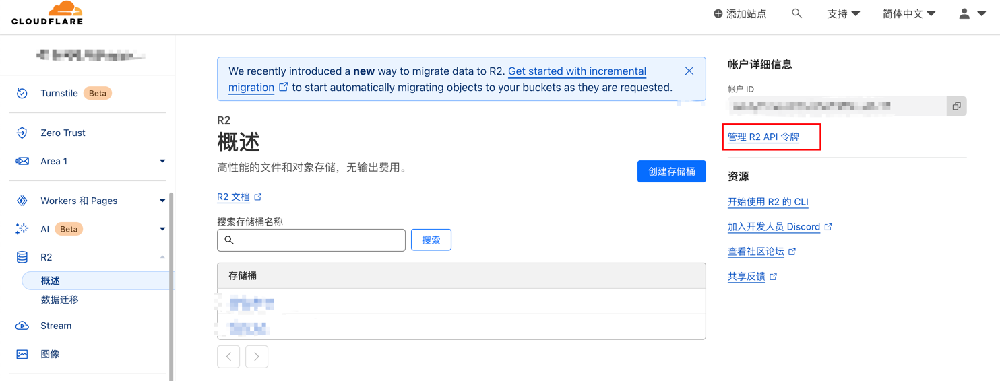
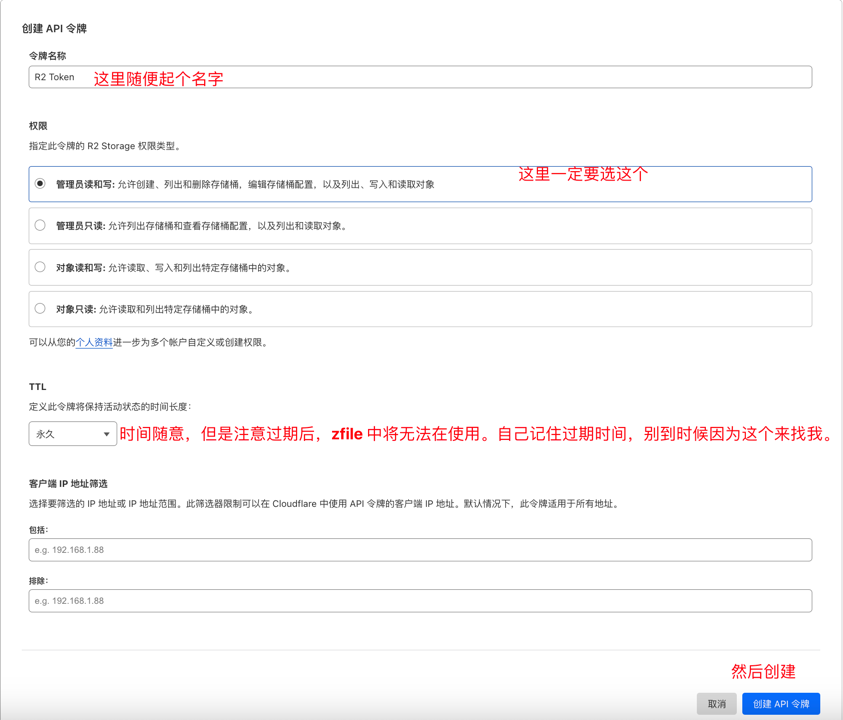
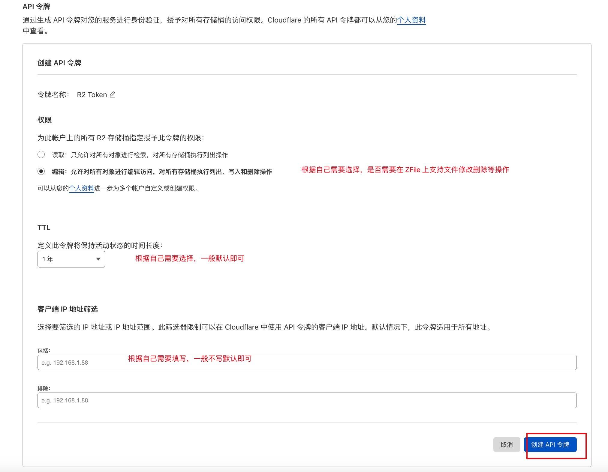
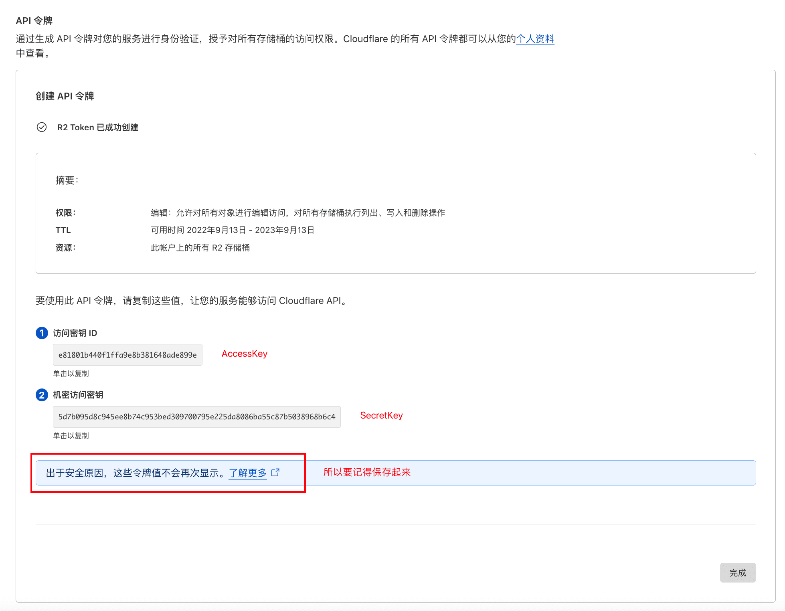

# Cloudflare R2

## 存储源名称

## AccessKey & SecretKey

其他选项：
- 地域：`auto`，来源官方文档说明：https://developers.cloudflare.com/r2/platform/s3-compatibility/api/
- 加速域名：可以不写，如果写了，那么就是使用加速域名访问，否则使用默认域名访问
- 是否是私有空间：这个无所谓，因为 Cloudflare R2 强制都是私有空间，所以这个选项无效。
- 域名风格: 选择 "虚拟主机路径"
- 是否自动配置 CORS 跨域设置：选择否，因为 Cloudflare R2 不支持这个 API，且无法通过其他方式设置，**也就是说目前 Cloudflare R2 无法使用 API 对接上传功能**，信息来源自 2022-09-13，更新进度请参考官方 Github Issue：https://github.com/cloudflare/cloudflare-docs/issues/4455
- 其他：根据自己情况选择即可，一般不会有问题。
