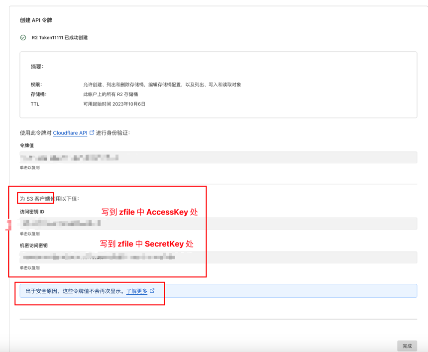
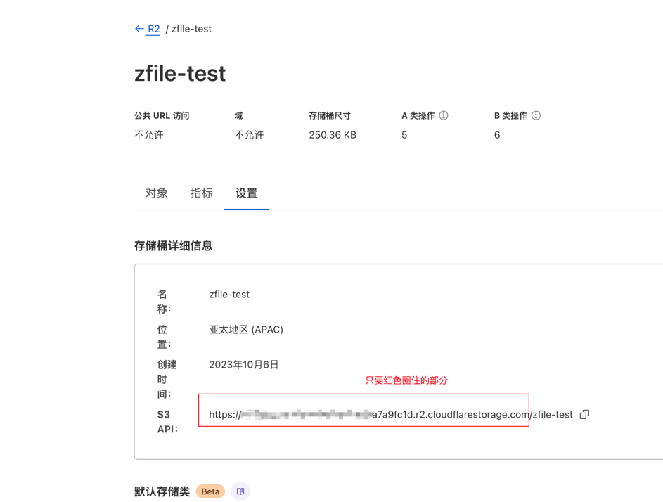

# Cloudflare R2

Cloudflare R2 在 ZFile 中选择 `S3通用协议` 即可，然后填写对应的信息即可。

## AccessKey & SecretKey

## 地域 & 存储空间名称

zfile 中**地域**填写 `auto`，然后创建存储源时要按照下图填写：

## EndPoint

其他选项：
- `Bucket 域名 / CDN 加速域名`：可以不写，如果你给这个 R2 空间绑定了域名，那么可以写上，如果写上后无法正常下载/预览问题，但不写正常，那就是你的域名配置有问题。
- `是否是私有空间`：勾选上
- `域名风格`: 选择 "虚拟主机路径"
- `是否自动配置 CORS 跨域设置`：选择是，这个很重要，不然你无法通过 ZFile 上传文件，如果勾选上这个，保存存储源时提示 "设置跨域失败..."，那就检查你的令牌是否是按照上图中的权限勾选的（令牌要用 `管理员读和写` 权限）。
