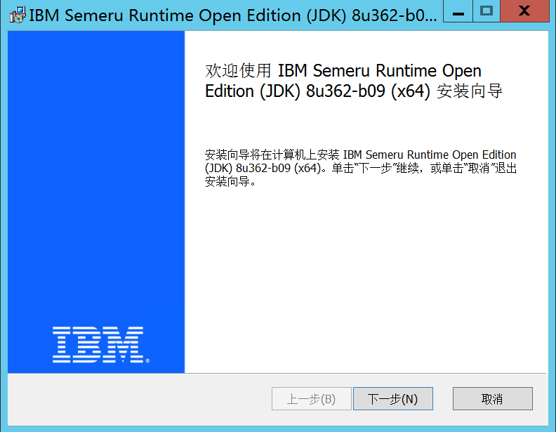
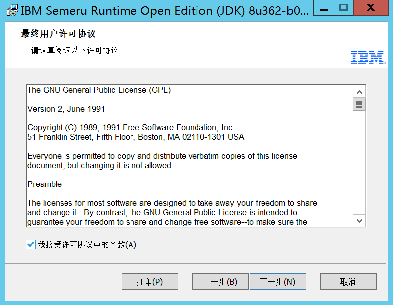
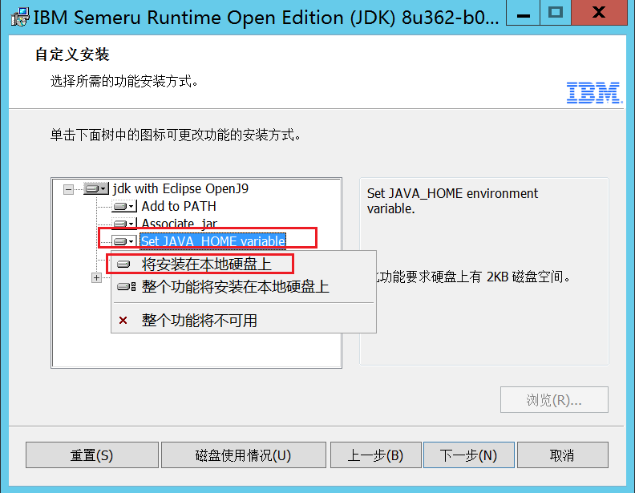
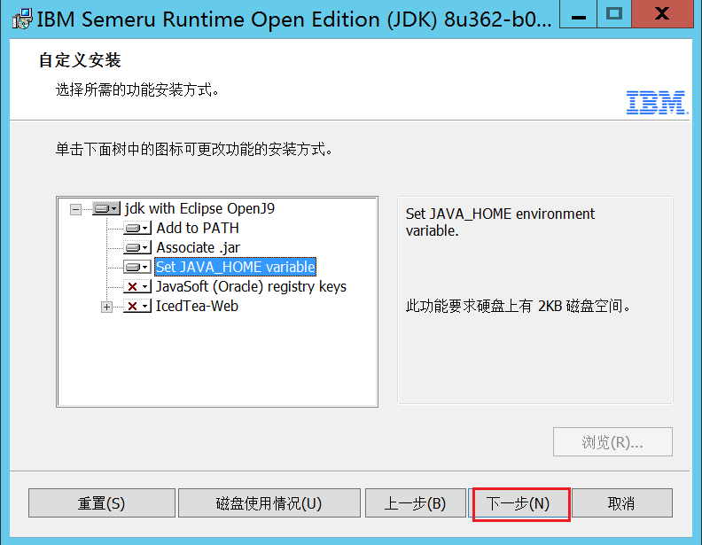

import HelpInfoSub from './help-install-sub.mdx';

# Windows

## 安装 JDK

:::tip 提示

如已安装 Java 环境（Java 1.8）可跳过此步骤，且注意，只支持 Java 1.8，更高版本无法兼容，请保证你环境遍历中是 1.8 版本的。

:::


安装 Java 1.8, 步骤如下:


先下载 JDK 1.8，这里使用 [IBM semeru8 版本](https://github.com/ibmruntimes/semeru8-binaries)，从清华大学镜像站下载，[点击下载](https://mirrors.tuna.tsinghua.edu.cn/github-release/ibmruntimes/semeru8-binaries/LatestRelease/ibm-semeru-open-jdk_x64_windows_8u362b09_openj9-0.36.0.msi)

<div className={ 'w-1/2' }>







</div>

## 下载项目

下载文件 https://c.jun6.net/ZFILE/zfile-release.jar

## 启动项目

在 cmd 执行命令, 下面的示例为下载 `zfile` 程序到了 `D:/Downloads/zfile-release.jar` 时的启动方式。
如你下载到了其他路径就需自行更改最后你实际下载的目录：

```bash showLineNumbers
# 不可关闭命令行，关闭即停止程序，或使用 ctrl + c 命令停止程序
java -Dfile.encoding=utf-8 -jar -Dserver.port=8080 D:/Downloads/zfile-release.jar
```

启动后访问 [http://localhost:8080](http://localhost:8080) 即可看到效果。

## 配置文件 {#config}

如需要修改配置文件, 下载配置文件 [`application.properties`](https://c.jun6.net/ZFILE/application.properties) , 放到 `jar` 文件同路径起名为 `application.properties` 即可.

## 更新版本

重新下载最新文件替换后重新启动即可： https://c.jun6.net/ZFILE/zfile-release.jar

## 帮我安装🔍
<HelpInfoSub />
